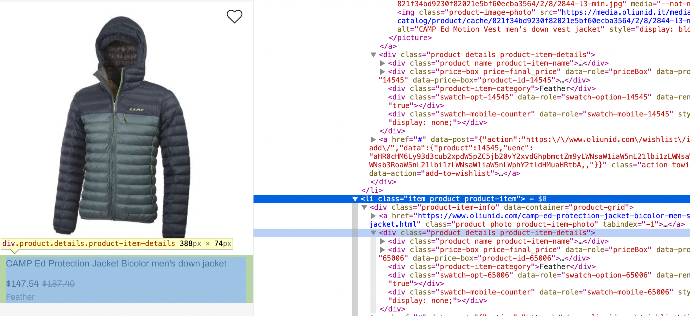

# :spider:Web Scraping with Beatiful Soup:stew:


Beatiful Soup (in its latest version, BS4) is a well known and wide used Python library, very useful to scrape data from websites. Although there are more advanced tools, BS4 is still one of the first choices among data analysts when they need to gather information. 

I won't bore you with more text that you can find anywhere in the internet :wink:, so let's go with the explanation. If you wanna follow along, you'll need to install the `requests` library, and (obviously) BeatifulSoup. We can make the example a bit more real by using `pandas` at the end, so we can see where would be normally go once we scraped some data. You can do that from the command line or terminal:

```
pip install requests
pip install beatifulsoup4
pip install pandas
```


(Feel free to clone the repo and use the Jupyter Notebook to see the code running. If you do so, you can write `pip install -r requirements.txt and all the needed packages will get installed.)

### Importing libraries
We need to import the `requests` library to actually get the html document from the Internet, as BS4 is just a parser (like a translator) that will structure the data for us.  The `json` library will help us to save the gathered data. Spoiler alert: We will need also to import `NoneType`, it will come handy to handle missing data. And datetime, just in case.

```python
    import requests
    import pandas as pd
    import json
    from bs4 import BeautifulSoup
    from types import NoneType
    from datetime import datetime
```
## :thinking: A bit of previous thinking

~~Normally~~ Ideally, before starting any project, we should sit down and think a bit how will we structure the code: What functionality do I need? How will I write the code? How can I make the code reusable? Those are questions worth asking, they will save a lot of time (and headaches) in the future. Fortunately for you, I've already done that. I'll roughly explain what every section does, and we'll go in detail below. 

We will divide the code in different methods, so we can reuse parts of them. Another advantage is that the code will be more readable, something that our colleagues (or ourselves in the future) will thank.

So, let's think what things do we want to do with the code, from the more generic to the more specific:
- Ultimately, we want to retrieve a list of jackets, with their prices and other characteristics:
  
    ```python
    def get_jackets():
        pass
    ```
- For that, we need to gather from the website all the html elements (also called tags) that contain that information:
  
    ```python
    def get_jacket_tags():
        pass
    ```
- The method above will take a url and use Beatiful Soup to find all the tags we need. But for that we need a parsed html:

    ```python
    def get_parsed_html(url):
        pass
    ```
- Once we have the tags, we will have to process them, saving all the information in useful and efficient way. A python dictionary will do.
  
    ```python
    def tag_to_dict_jacket(node):
        pass
    ```
And that's all! That's all we need to make our study. Let's jump to it, then. Now, we're gonna go from more specific to more general. Kinda walking backwards. Like a crab :crab:.

## :clipboard: Method `get_parsed_html`
This one is short, it takes a url as a parameter, and returns the parsed html. Beatiful Soup does that for us.

```python
    def get_parsed_html(url):
        page = requests.get(url)
        return BeautifulSoup(page.content, 'html.parser')
```
## :flags: Method `get_jacket_tags`
Here is when things start to get interesting.

First we have to choose something to study. In this example, we're gonna look at the prices and other information of different mountain gear jackets from [Oliunid](https://www.oliunid.com). We write two variables where we save the urls from which we're gonna gather the information. Because the site has many jackets saved in different pages, we need the second url to iterate through them. We're gonna use that later, for now, let's save the parsed html in a variable.
```python
    first_page = "https://www.oliunid.com/clothing-for-climbing/men-s-climbing-clothing/men-s-climbing-jackets.html"
    other_pages = "https://www.oliunid.com/clothing-for-climbing/men-s-climbing-clothing/men-s-climbing-jackets.html?p={}"
    html = get_parsed_html(first_page)
```

### :mag: The magic happens: `find_all`
The parsed html that BS4 has provided us comes with a bunch of handy methods. One of the most comonly used is `find_all` [(read the docs)](https://beautiful-soup-4.readthedocs.io/en/latest/#find-all). With this function, we cand find all the tags in a html document that match a certain selection, and we can use the tag's attributes to specify our search.

And now the important part. How do I know where is the information of the jackets? Very easy, right click on one of the jackets and then click in 'Inspect' (or Inspeccionar in spanish).


A tab opens, normally to the right. There we can see the html file of that webpage, with all the tags, attributes and information. Hovering the mouse over the tags will highlight the element in the webpage, so we can identify what do we need. In this case we need the a `div` tag with a `class` attribute with value "product details product-item-details".



Now, the only thing left is use the `find_all` function:

```python
    jacket_tags = html.find_all('div', {'class' : 'product details product-item-details'})
```

### :bookmark_tabs: How many pages?
Once we have the jackets from the first page, now we want to iterate through the rest of the pages and do the same. But, how many pages do we have? When exploring the site, we can see that, for example, there are 3 pages. But that might change in the future, when we actually run all the code. The best way to do this is to actually extract that information from the website. At the bottom, we can see a text saying "Page 1 of 3". We already know how to see the html element that corresponds to this text. If we inspect the element, we can see that this text is in a `span` tag that's inside a `li` tag with a class attribute with value 'item summary'. We say that `span` is a *child* of `li`.


Now we want only one tag. The method `find` does exactly the same as find_all: it goes through all the document and returns the first occurence of what we're looking for. The following line is almost the same as the one where we described `find_all`. The only difference is that we're accesing the child of the returned tag with the syntax `.[child]`.

```python
    summary = html.find('li', {'class': 'item summary'}).span
```

But if we see what's in this variable, we see the whole tag: 

```html
    <span>Page 1 of 3</span>
```
We only need the content of the tag. We can do this simply writing `summary.string`. After that, we take only the last character (the total number of pages) and cast it to an integer to use it in a for loop later.

```python
    pages = int(summary.string[-1])
```

### :scroll: Extending the list of jacktes.

This one is easy. If we make a call to `type(jacket_tags)` we'll see that it is an instance of `bs4.element.ResultSet`. This is a BS4 class that inherits from `list`, we can use the `extend` method to add the jackets from the other pages, now that we know how many pages do we have. We wrap it in a for loop:

```python
for i in range(2,pages):
        html = get_parsed_html(other_pages.format(i))
        jacket_tags.extend(
            html.find_all(
                'div', 
                {'class' : 'product details product-item-details'}
            )
        )
```

Buff, finally... The whole method ends up like this:
```python
def get_jacket_tags():
    first_page = "https://www.oliunid.com/clothing-for-climbing/men-s-climbing-clothing/men-s-climbing-jackets.html"
    other_pages = "https://www.oliunid.com/clothing-for-climbing/men-s-climbing-clothing/men-s-climbing-jackets.html?p={}"
    html = get_parsed_html(first_page)
    jacket_tags = html.find_all('div', {'class' : 'product details product-item-details'})
    pages = int(html.find('li', {'class': 'item summary'}).span.string[-1])
    for i in range(2,pages):
        html = get_parsed_html(other_pages.format(i))
        jacket_tags.extend(
            html.find_all(
                'div', 
                {'class' : 'product details product-item-details'}
            )
        )
    return jacket_tags
```
## :book: Method `tag_to_dict_jacket`
Ok, some would say that the scraping part is over. We already have the information of all the jackets, right? But we have it in a very (*very*) unconvenient format, needless to say that we also have a lot of information that we don't need at all. Let's see what's in one of the jacket tags:
```python
    print(jacket_tags[0].prettify())
```
```html
<div class="product details product-item-details">
    <div class="product name product-item-name">
        <a class="product-item-link"
            href="https://www.oliunid.com/bd-black-diamond-alpine-start-hoody-giacca-uomo.html">
            BD Black Diamond Alpine Start Hoody men's jacket
        </a>
    </div>
    <div class="price-box price-final_price" data-price-box="product-id-57696" data-product-id="57696"
        data-role="priceBox"> 
        <span class="normal-price">
             <span class="price-container price-final_price tax weee">
                <span class="price-label">As low as</span>
                <span class="price-wrapper" data-price-amount="98.78"
                    data-price-type="finalPrice" id="product-price-57696">
                    <span class="price">$98.78</span>
                </span>
            </span>
        </span> 
        <span class="old-price sly-old-price">
            <span class="price-container price-final_price tax weee"> 
                <span class="price-label">Regular Price</span> 
                <span class="price-wrapper" data-price-amount="131.82" data-price-type="oldPrice"
                    id="old-price-57696">
                    <span class="price">$131.82</span>
                </span> 
            </span>
        </span> 
    </div>
    <div class="product-item-category">Shell Jackets</div>
    <div class="swatch-opt-57696" data-role="swatch-option-57696"></div>
    <div class="swatch-mobile-counter" data-role="swatch-mobile-57696"></div>
</div>
```

Oops, those are a lot of things. If we pass the information in this format to a colleague, we might get fired (or murdered). One way to save all the information is in a dictionary. From that point it's easy to do almost whatever we want with it. We can save it in a json file, or we can create a pandas `DataFrame` to analyze the data.

```python
    jackets = {}
```

First, we have to decide what information do we wanna keep in the dictionary. Reading a bit the html element where we have all the data we see some things that might be interesting to keep:
- Brand and model, under `<a class="product-item-link'>`
- Link to the jacket, also under`<a class="product-item-link'>`, but in the attribute `href`
- Price, under `<span data-price-type="finalPrice">`
- We might want to save also the old price, `<span data-price-type="oldPrice">`
- Category, `<div class="product-item-category">`

After we've identified all the tags and the attributes that interest us, we use the `find` method to get the html elements. Nothing new here:
```python
    link = node.find('a', class_='product-item-link')
    old_price = node.find('span', {'data-price-type':'oldPrice'})
    price = node.find('span', {'data-price-type':'finalPrice'})
    category = node.find('div', class_='product-item-category')
```

Now, let's extract the information from those tags. Normally we will only need to call the `.string` attribute of the node. The exception in our case is the actual link to the jacket page, which it's not *in* the `a` tag, but defined in its `href` attribute. We can access to an attribute's content with the syntax `node[attribute_name]`.

Another thing that we have to do is process the price. We will want to do some calculations, so let's keep only the numerical part of the string and cast it to a float value. Actually, let's also save the currency. And, now that we're here, let's also save the date when we're doing the scraping. It can be interesting if we want to run the scraper once a month, for example. By saving the date, we will be able to study how the the prices vary over time. 

```python
    jacket['brand'] = link.string
    jacket['link'] = link['href']
    jacket['currency'] = old_price.string[0]
    jacket['old_price'] = float(old_price.string[1:])
    jacket['price'] = float(price.string[1:])
    jacket['category'] = category.string
    jacket['date'] = datetime.now()
```

This is the final method. We have separated some of the logic in another one, just to make it more pretty.

```python
    def get_information_tags(jacket_tag):
        link = jacket_tag.find('a', {'class': 'product-item-link'})
        old_price = jacket_tag.find('span', {'data-price-type':'oldPrice'})
        price = jacket_tag.find('span', {'data-price-type':'finalPrice'})
        category = jacket_tag.find('div', {'class': 'product-item-category'})
        return link, old_price, price, category

    def tag_to_dict_jacket(jacket_tag):
        jacket = {} # Creates the dictionary
        link, old_price, price, category = get_information_tags(jacket_tag)
        jacket['brand'] = link.string
        jacket['link'] = link['href']
        jacket['currency'] = old_price.string[0]
        jacket['old_price'] = float(old_price.string[1:])
        jacket['price'] = float(price.string[1:])
        jacket['category'] = category.string
        jacket['date'] = datetime.now()
        return jacket
```
## :kimono: Method `get_jackets`
This is our final method, very easy. We just get all the jacket tags, convert them to a dictionary, and add them to a list. 

```python
    def get_jackets():
        tags = get_jacket_tags()
        return [tag_to_dict_jacket(tag) for tag in tags]
```
## :phone: Handling errors
Let's run the code and see what do we get.

```python
    jackets = get_jackets()
    jackets 
```
```python 
---------------------------------------------------------------------------
AttributeError                            Traceback (most recent call last)
/Users/wildbass/Documents/DataScience/react-ds-web-scrapping-Bass2015/nbs/4_Scraping.ipynb Celda 14 in <cell line: 1>()
----> 1 jackets = get_jackets()
      2 jackets

/Users/wildbass/Documents/DataScience/react-ds-web-scrapping-Bass2015/nbs/4_Scraping.ipynb Celda 14 in get_jackets()
      1 def get_jackets():
      2     tags = get_jacket_tags()
----> 3     return [tag_to_dict_jacket(tag) for tag in tags]

/Users/wildbass/Documents/DataScience/react-ds-web-scrapping-Bass2015/nbs/4_Scraping.ipynb Celda 14 in <listcomp>(.0)
      1 def get_jackets():
      2     tags = get_jacket_tags()
----> 3     return [tag_to_dict_jacket(tag) for tag in tags]

/Users/wildbass/Documents/DataScience/react-ds-web-scrapping-Bass2015/nbs/4_Scraping.ipynb Celda 14 in tag_to_dict_jacket(jacket_tag)
     11 jacket['brand'] = link.string
     12 jacket['link'] = link['href']
---> 13 jacket['currency'] = old_price.string[0]
     14 jacket['old_price'] = float(old_price.string[1:])
     15 jacket['price'] = float(price.string[1:])
     16 jacket['date'] = datetime.now()

AttributeError: 'NoneType' object has no attribute 'string'
```
Oh, no! We get an error! Reading through the error prompt we see that `old_price` is a `NoneType` object. That's because the `find` method returns None when it doesn't find what we're looking for, and we haven't add anything to the code to handle this error. Let's be conservative, and asume that any of the tags that we want could be missing. There are some elegant ways to handle this errors (see [try except syntax](https://docs.python.org/3/tutorial/errors.html) in Python), but let's just do it fast and dirty. We will add an if statement to see if we have a NoneType and, in that case, we'll asign a `None` to that position in the dictionary. Later we can use pandas to handle those nones.

Let's rewrite then the `tag_to_dict_jacket` method (I know, it's dirty. And ugly. And unefficient. But let's keep moving): 

```python
    def tag_to_dict_jacket(jacket_tag):
        jacket = {} # Creates the dictionary
        link, old_price, price, category = get_information_tags(jacket_tag)
        jacket['brand'] = link.string if not isinstance(link, NoneType) else None
        jacket['link'] = link['href'] if not isinstance(link, NoneType) else None
        jacket['currency'] = old_price.string[0] if not isinstance(old_price, NoneType) else None
        jacket['old_price'] = float(old_price.string[1:]) if not isinstance(old_price, NoneType) else None
        jacket['price'] = float(price.string[1:]) if not isinstance(price, NoneType) else None
        jacket['category'] = category.string if not isinstance(category, NoneType) else None
        jacket['date'] = datetime.now()
        return jacket
```
Ok, let's try again now:
```python
    jackets = get_jackets()
    jackets
```
```json
[{'brand': "BD Black Diamond Alpine Start Hoody men's jacket",
  'link': 'https://www.oliunid.com/bd-black-diamond-alpine-start-hoody-giacca-uomo.html',
  'currency': '$',
  'old_price': 130.43,
  'price': 97.74,
  'category': 'Shell Jackets',
  'date': datetime.datetime(2022, 9, 3, 16, 50, 47, 622386)},
 {'brand': "BD Black Diamond Deploy Wind Jacket windproof men's jacket",
  'link': 'https://www.oliunid.com/bd-black-diamond-deploy-wind-jacket-windproof-men-s-jacket.html',
  'currency': '$',
  'old_price': 130.43,
  'price': 110.78,
  'category': 'Shell Jackets',
  'date': datetime.datetime(2022, 9, 3, 16, 50, 47, 622513)},
  
  ...

 {'brand': "BD Black Diamond FineLine Stretch Rain Shell men's hard shell jacket",
  'link': 'https://www.oliunid.com/bd-black-diamond-fineline-stretch-rain-shell-giacca-hard-shell-uomo.html',
  'currency': None,
  'old_price': None,
  'price': 0.0,
  'category': 'Hard Shell',
  'date': datetime.datetime(2022, 9, 3, 16, 50, 47, 622609)}]
```
Success! :partying_face: We now have a list of beatiful dictionaries that we got with Beautiful Soup

## :airplane: Where to go from here?
Now that we have gathered all the data, there are many possibilities. We can save the dictionary as a json file to process it later, for example. If we run the code periodically, we can extend that file with new data, and make new studies with the time variable.

```python
    with open('jackets.json', 'w') as file:
        json.dump(jackets, file, indent=4)
```

 With this json (or directly from the dictionary) we can create a pandas DataFrame to start studying and cleaning the data. 

Actually, let's see how this would look.

```python
    df = pd.DataFrame(jackets)
    df.head()
```


Well, here we see one of our "`None`s", among other things (like the third jacket having a price of $0, what a deal!). We could keep investigating the dataframe now, to see if the only missing values are the old price values. In that case, we could retweak the code to save the currency from the final price instead, and maybe we could asign the final price to the old price as well (having no discount). We could also process the currency (pass the symbol to USD), and separate the brand in two fields (brand and model). If we do all those things while we are saving the info, our data will be much cleaner, thus much easier to handle. 

But that's data cleansing, another topic for another tutorial.

Have fun scraping! :wave: